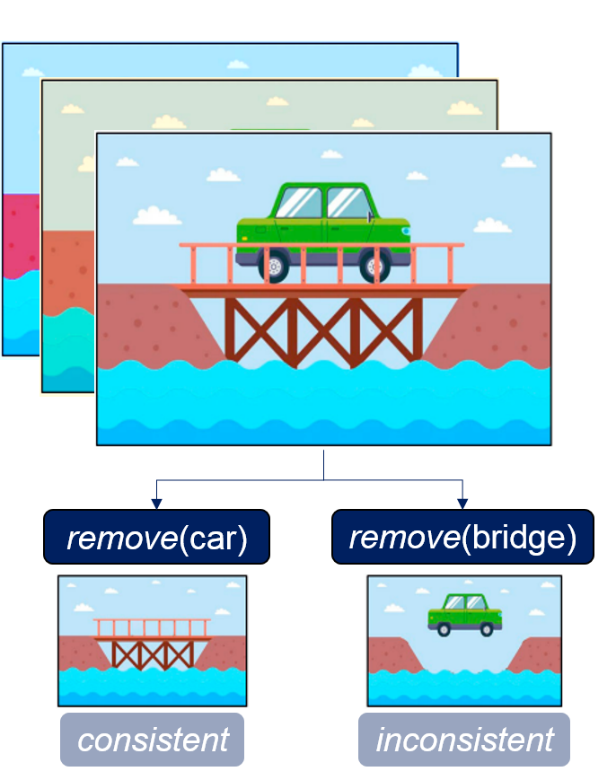

# causality_conv_nets
This is repository contains the code to experiment with our framework of Causality-driven Convolutional Neural Networks.

[[**Conference Paper**](https://openaccess.thecvf.com/content/ICCV2023W/CVAMD/html/Carloni_Causality-Driven_One-Shot_Learning_for_Prostate_Cancer_Grading_from_MRI_ICCVW_2023_paper.html)] [[**Journal Paper**](https://arxiv.org/abs/2309.10399)]

## Main idea and related work

The rationale behind the whole project is the concept of _causal disposition_ from [Lopez-Paz, D. (2017)](https://github.com/gianlucarloni/causality_conv_nets/assets/91902479/a4040479-d4ef-4e6b-afc5-07fb73018f71).
Given an image dataset, we can have insights into observable footprints that reveal the dispositions of the object categories appearing in the images.
For instance, if two objects/artifacts _A_ and _B_ are present in the images, we can define the causal disposition of _A_ w.r.t. _B_ by counting the number of images in the dataset where if we remove _A_ then _B_ also disappear.

## Get started 

...
