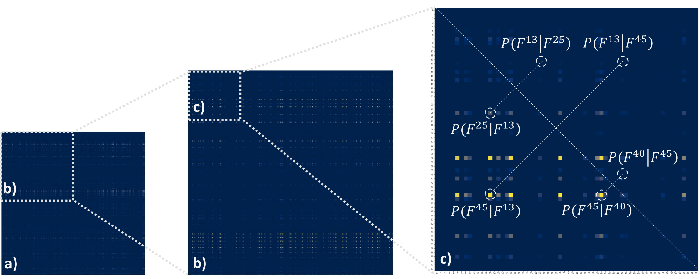
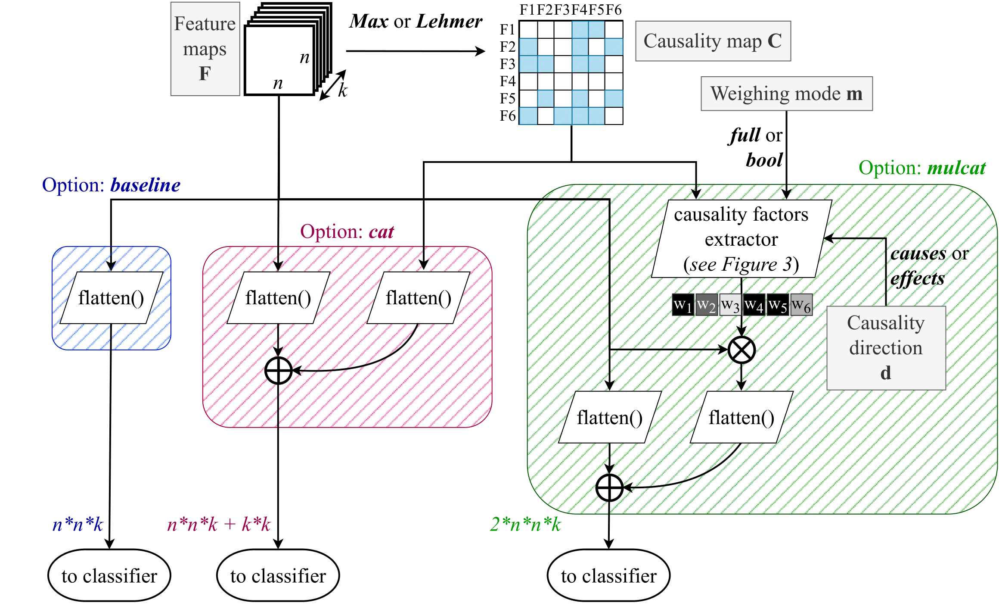
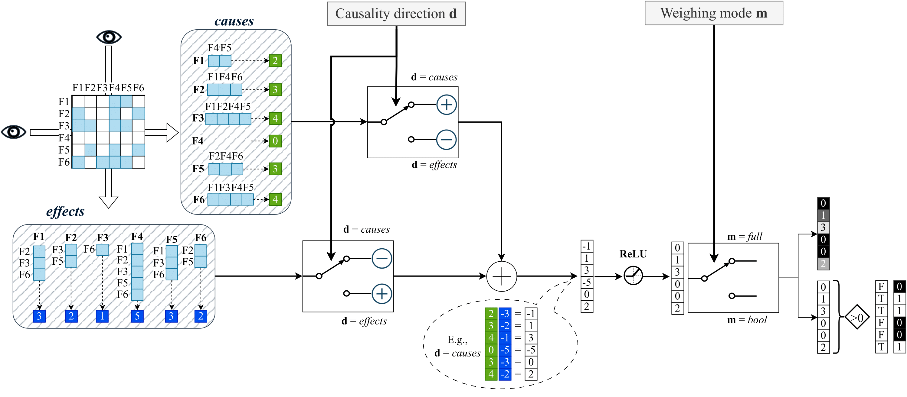

# causality_conv_nets
This is repository contains the code to experiment with our framework of Causality-driven Convolutional Neural Networks.

[[**Conference Paper**](https://openaccess.thecvf.com/content/ICCV2023W/CVAMD/html/Carloni_Causality-Driven_One-Shot_Learning_for_Prostate_Cancer_Grading_from_MRI_ICCVW_2023_paper.html)] [[**Journal Paper**](https://arxiv.org/abs/2309.10399)]

## Main idea and related work

The rationale behind the whole project is the concept of _causal disposition_ from [Lopez-Paz, D. (2017)](https://github.com/gianlucarloni/causality_conv_nets/assets/91902479/a4040479-d4ef-4e6b-afc5-07fb73018f71).
Given an image dataset, we can have insights into observable footprints that reveal the dispositions of the object categories appearing in the images.
For instance, if two objects/artifacts _A_ and _B_ are present in the images, we can define the causal disposition of _A_ w.r.t. _B_ by counting the number of images in the dataset where if we remove _A_ then _B_ also disappear.

**Intuition**: any causal disposition induces a set of conditional asymmetries between the artifacts from an image (features, object categories, etc.) that represent (weak) causality signals regarding the real-world scene. **Can computer vision models infer such asymmetries autonomously?**

[Terziyan and Vitko (2023)](https://www.sciencedirect.com/science/article/pii/S1877050922023237) suggests a way to compute estimates for possible causal relationships within images via CNNs. 
When a feature map $F^i$ contains only non-negative numbers (e.g., thanks to ReLU functions) and is normalized in the interval $[0,1]$, we can interpret its values as probabilities of that feature to be present in a specific location. For instance, $F^i_{r,c}$ is the probability that the feature $i$ is recognized at coordinates ${r,c}$.
By assuming that the last convolutional layer outputs and localizes to some extent the object-like features, we may modify the architecture of a CNN such that the $n \times n$ feature maps ($F^1,F^2,\dots F^k$) obtained from that layer got fed into a new module that computes pairwise conditional probabilities of the feature maps. The resulting $k \times k$ map would represent the causality estimates for the features and be called **causality map**. 

Given a pair of feature maps $F^i$ and $F^j$ and the formulation that connects conditional probability with joint probability, $P(F^i|F^j) = \frac{P(F^i,F^j)}{P(F^j)}$, the authors suggest to heuristically estimate this quantity by adopting two possible methods, namely \textit{Max} and \textit{Lehmer}.
The _Max_ method considers the joint probability to be the maximal presence of both features in the image (each one in its location):
    $P(F^i|F^j) = \frac{(\max_{r,c} F^i_{r,c})\cdot (\max_{r,c} F^j_{r,c})}{\sum_{r,c} F^j_{r,c}}$
On the other hand, _Lehmer_ method entails computing 
    $P(F^i|F^j)_p = \frac{LM_p(F^i \times F^j)}{LM_p(F^j)}$
 
where $F^i \times F^j$ is a vector of $n^4$ pairwise multiplications between each element of the two $n \times n$ feature maps, while $LM_p$ is the generalized Lehmer mean function with parameter $p$, which is an alternative to power means for interpolating between minimum and maximum of a vector $x$ via harmonic mean ($p=-2$), geometric mean ($p=-1$), arithmetic mean ($p=0$), and contraharmonic mean ($p=1$):
$LM_p(x) = \frac{\sum_{k=1}^n x_k^p}{\sum_{k=1}^n x_k^{p-1}}$.
These equations could be used to estimate asymmetric causal relationships between features $F^i$ and $F^j$, since, in general, $P(F^i|F^j) \neq P(F^j|F^i)$. By computing these quantities for every pair $i$ and $j$ of the $k$ feature maps, the $k \times k$ causality map is obtained. We interpret asymmetries in such probability estimates as weak causality signals between features, as they provide some information on the cause-effect of the appearance of a feature in one place of the image, given the presence of another feature within some other places of the image. Accordingly, a feature may be deemed to be the reason for another feature when $P(F^i|F^j) > P(F^j|F^i)$, that is ($F^i \rightarrow F^j$), and vice versa. 

We propose a new light-weight module - **causality factors extractor** - to compute weights for the feature maps. Specifically, we propose two new schemes, namely **Mulcat** and **Mulcatbool**, to embed causal information to CNNs.

Instead of concatenating the flattened causality map to the flattened set of feature maps just before the classifier as [Terziyan and Vitko (2023)](https://www.sciencedirect.com/science/article/pii/S1877050922023237), here we propose to use the causality map to compute a vector of causality factors that multiply (i.e., weighs) the feature maps so that each feature map is strengthened according to its causal influence within the image's scene. 
After multiplication, the obtained causality-driven version of the feature maps is flattened and concatenated to the flattened original ones, producing a $2 \times n\times n \times k$ input to the classifier.

At the core of the **mulcat** option stands our **causality factors extractor** module, which yields the vector of weights needed to multiply the feature maps. The main idea here is to look for asymmetries between elements opposite the main diagonal of the causality map, as they represent conditional asymmetries entailing possible cause-effect relationships. Indeed, some features may be more often found on the left side of the arrow (i.e., $F\rightarrow$) than on the right side (i.e., $\rightarrow F$). 

## Get started 

...
