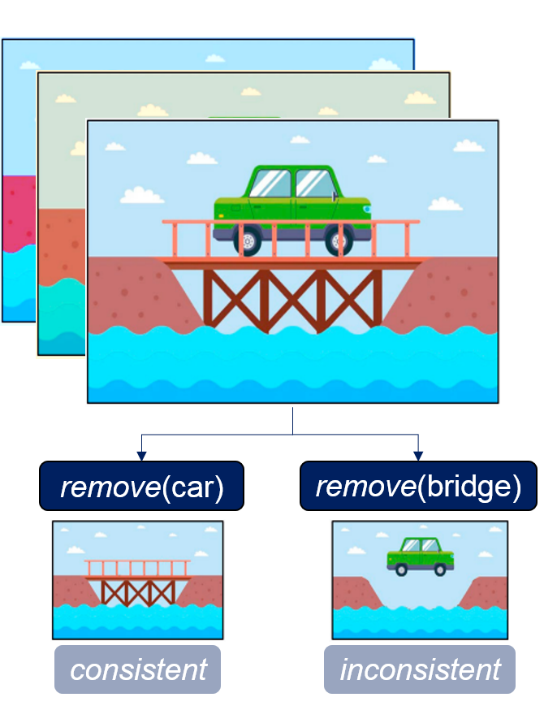
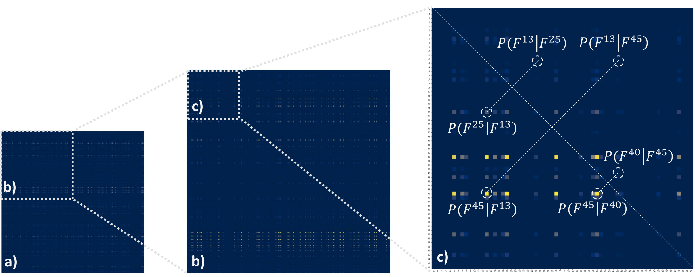
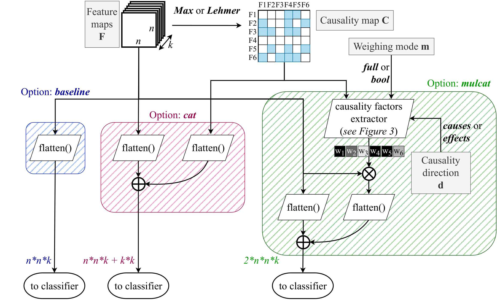
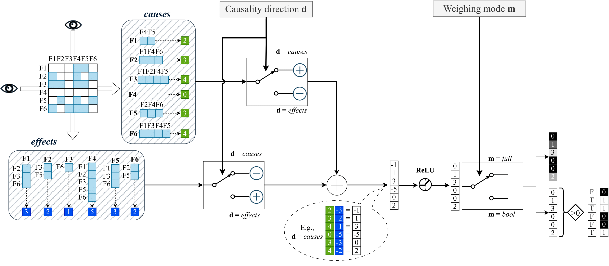
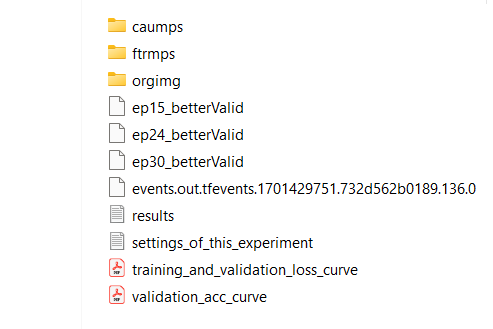

This repository contains the code to experiment with our framework of Causality-driven Convolutional Neural Networks.

[[**Journal Paper** (under review)](https://arxiv.org/abs/2309.10399)]
[[**ICCV 2023 Conference Paper**](https://openaccess.thecvf.com/content/ICCV2023W/CVAMD/html/Carloni_Causality-Driven_One-Shot_Learning_for_Prostate_Cancer_Grading_from_MRI_ICCVW_2023_paper.html)]

To read about the rationale behind the investigation, please have a look at the following section.
Instead, to [**Get Started**](https://github.com/gianlucarloni/causality_conv_nets/tree/main#get-started) with the coding, just skip to the section at the bottom!

# Main idea and related work

## The causal disposition concept
The rationale behind the whole project is the concept of _causal disposition_ from [Lopez-Paz, D. (2017)](https://github.com/gianlucarloni/causality_conv_nets/assets/91902479/a4040479-d4ef-4e6b-afc5-07fb73018f71).
Given an image dataset, we can have insights into observable footprints that reveal the dispositions of the object categories appearing in the images.
For instance, if two objects/artifacts _A_ and _B_ are present in the images, we can define the causal disposition of _A_ w.r.t. _B_ by counting the number of images in the dataset where if we remove _A_ then _B_ also disappear.



**Intuition**: any causal disposition induces a set of conditional asymmetries between the artifacts from an image (features, object categories, etc.) that represent (weak) causality signals regarding the real-world scene. **Can computer vision models infer such asymmetries autonomously?**

[Terziyan and Vitko (2023)](https://www.sciencedirect.com/science/article/pii/S1877050922023237) suggests a way to compute estimates for possible causal relationships within images via CNNs. 
When a feature map $F^i$ contains only non-negative numbers (e.g., thanks to ReLU functions) and is normalized in the interval $[0,1]$, we can interpret its values as probabilities of that feature to be present in a specific location. For instance, $F^i_{r,c}$ is the probability that the feature $i$ is recognized at coordinates ${r,c}$.
By assuming that the last convolutional layer outputs and localizes to some extent the object-like features, we may modify the architecture of a CNN such that the $n \times n$ feature maps ($F^1,F^2,\dots F^k$) obtained from that layer got fed into a new module that computes pairwise conditional probabilities of the feature maps. The resulting $k \times k$ map would represent the causality estimates for the features and be called **causality map**. 

Given a pair of feature maps $F^i$ and $F^j$ and the formulation that connects conditional probability with joint probability, $P(F^i|F^j) = \frac{P(F^i,F^j)}{P(F^j)}$, the authors suggest to heuristically estimate this quantity by adopting two possible methods, namely _Max_ and _Lehmer_.
The _Max_ method considers the joint probability to be the maximal presence of both features in the image (each one in its location): $P(F^i|F^j) = \frac{(\max_{r,c} F^i_{r,c})\cdot (\max_{r,c} F^j_{r,c})}{\sum_{r,c} F^j_{r,c}}$
    
On the other hand, _Lehmer_ method entails computing $P(F^i|F^j)\_p = \frac{LM_p(F^i \times F^j)}{LM_p(F^j)}$ , where $F^i \times F^j$ is a vector of $n^4$ pairwise multiplications between each element of the two $n \times n$ feature maps, while $LM_p$ is the generalized Lehmer mean function with parameter $p$: $LM_p(x) = \frac{\sum_{k=1}^n x_k^p}{\sum_{k=1}^n x_k^{p-1}}$.
These equations could be used to estimate asymmetric causal relationships between features $F^i$ and $F^j$, since, in general, $P(F^i|F^j) \neq P(F^j|F^i)$. By computing these quantities for every pair $i$ and $j$ of the $k$ feature maps, the $k \times k$ causality map is obtained. We interpret asymmetries in such probability estimates as **weak causal signals between features**, as they provide some information on the cause-effect of the appearance of a feature in one place of the image, given the presence of another feature within some other places of the image. Accordingly, a feature may be deemed to be the reason for another feature when $P(F^i|F^j) > P(F^j|F^i)$, that is ($F^i \rightarrow F^j$), and vice versa. The below figure shows a zoom-in of a sample causality map computed on $512$ feature maps extracted from an input image, where dashed circles indicate exemplar elements and their corresponding elements opposite the main diagonal, representing conditional asymmetries. We can see that, for instance, $P(F^{25}|F^{13}) > P(F^{13}|F^{25})$, that is $F^{25} \rightarrow F^{13}$, and $P(F^{45}|F^{40}) > P(F^{40}|F^{45})$, that is $F^{45} \rightarrow F^{40}$.



## Our method

We propose a new lightweight module - **causality factors extractor** - to compute weights for the feature maps. Specifically, we propose two new schemes, namely **Mulcat** and **Mulcatbool**, to embed causal information in CNNs.

Instead of concatenating the flattened causality map to the flattened set of feature maps just before the classifier as in Terziyan and Vitko (2023), here we propose to use the causality map to compute a vector of causality factors that multiply (i.e., weighs) the feature maps so that each feature map is strengthened according to its causal influence within the image's scene. 
After multiplication, the obtained causality-driven version of the feature maps is flattened and concatenated to the flattened original ones, producing a $2 \times n\times n \times k$ input to the classifier.



At the core of the **mulcat** option stands our **causality factors extractor** module, which yields the vector of weights needed to multiply the feature maps. The main idea here is to look for asymmetries between elements opposite the main diagonal of the causality map, as they represent conditional asymmetries entailing possible cause-effect relationships. Indeed, some features may be more often found on the left side of the arrow (i.e., $F\rightarrow$) than on the right side (i.e., $\rightarrow F$). 




# Get started 

In this project, we have utilized Docker to run our experiments on a multi-GPU cluster at our Institute. Therefore, you'll find side files to assist in the launching of the experiments, such as the 'docker_run_[].sh' bash scripts and the 'Dockerfile' files. If you're used to utilizing Docker too, then simply build your Image and Container following our instructions. Instead, if you want to execute the framework on your local machine without any Docker, just install the required dependencies and packages as shown below.

## Option A) Run it with Docker

### Build the Docker Image

To make things easier and tidier, we'll build two separate docker images: one for the training experiments ([Dockerfile](https://github.com/gianlucarloni/causality_conv_nets/blob/main/Dockerfile)) and the other for the test/inference execution ([Dockerfile_test](https://github.com/gianlucarloni/causality_conv_nets/blob/main/Dockerfile_test)). As you can see, they both inherit (i.e., "FROM" command) the "nvcr.io/nvidia/pytorch" image. In addition, they optionally 'pip install' some packages such as 'tqdm, einops, seaborn, scikit-learn' in the "RUN" command, and, finally, specify the correct "ENTRYPOINT" for the container.

Log in to your Docker and build two images with the above-mentioned Dockerfiles. Use a meaningful tag for them.

### Prepare the docker_run launching script in bash

The 'docker_run_loop_inner.sh' bash script is used to run the causality-driven and baseline versions of the networks with a hyperparameters optimization in a loop. The loop itself is actually performed within the python script itself, but here in the bash script, you must specify the lists of possible hyperparameter values.

That bash script ultimately executes the 'docker run' command on the training docker image built at the previous step. Please, follow the instructions contained in that bash script to customise it and to set everything you need about the GPU device(s), accordingly to your system setup.


## Option B) Run it on your local machine without Docker

... to be continued

# Once you finish training

Upon completion of the model's training, you will obtain a new folder with the training results. See the screenshot below for a visual example:



where _caumps_ will contain the causality maps obtained during validation epochs (in numpy format), _ftrmps_ will contain the feature maps extracted from the hooked inner layers of the network during validation epochs (in numpy format), and _orgimg_ optionally contains a sample of the input validation images onto which feature maps and causality maps are extracted. 

According to the models' saving policy, you will find _.pth_ files for the Top-_k_ best-performing models obtained during training. As of now, the saving policy is set to the Top-3 models, and the metric defining the best performers is a lower loss on the validation set. You can modify the saving policy and the metric at your ease. 

To facilitate model tracking, during the whole training process, a Tensorboard _events.out.tfevents._ object is stored. It will keep track of relevant curves and metrics during the epochs, to conveniently visualize them. You may follow the 'tutorial' in the next subsection to know how to use TensorboardX events.

## Utilizing Tensorboard and TensorboardX to visualize the _events_ file

1) On your local machine, create a new conda environment with _torch_ 2.0, _tensorboard_ 2.13, _tensorboardX_ 2.6.1. For the latter, you could just 'pip install tensorboardX', refer to the [official page]( https://pypi.org/project/tensorboardX/).
2) In a shell, locate (_cd_) the result folder obtained after training (which contains the _events.out.tfevents._ file)
3) Type the command: 'tensorboard --logdir .  --port 6001'. That will prompt you with a URL link, just CTRL+click on it, and a browser page will open.
   **Important** IN CASE THAT COMMAND DID NOT WORK (i.e., the link opens an error page), try the command: 'tensorboard --logdir . --host localhost  --port 8088'.
   
# Cite

Please cite our [paper](https://arxiv.org/pdf/2309.10399.pdf) if you found this code useful for your research:

```
@misc{carloni2023exploiting,
      title={Exploiting Causality Signals in Medical Images: A Pilot Study with Empirical Results}, 
      author={Gianluca Carloni and Sara Colantonio},
      year={2023},
      eprint={2309.10399},
      archivePrefix={arXiv},
      primaryClass={cs.CV}
}
```
